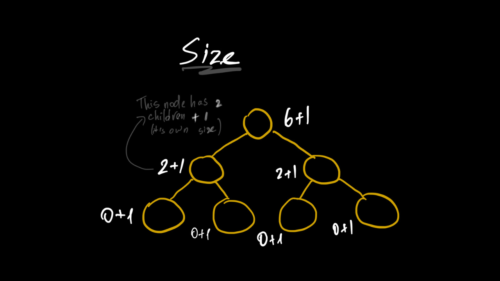
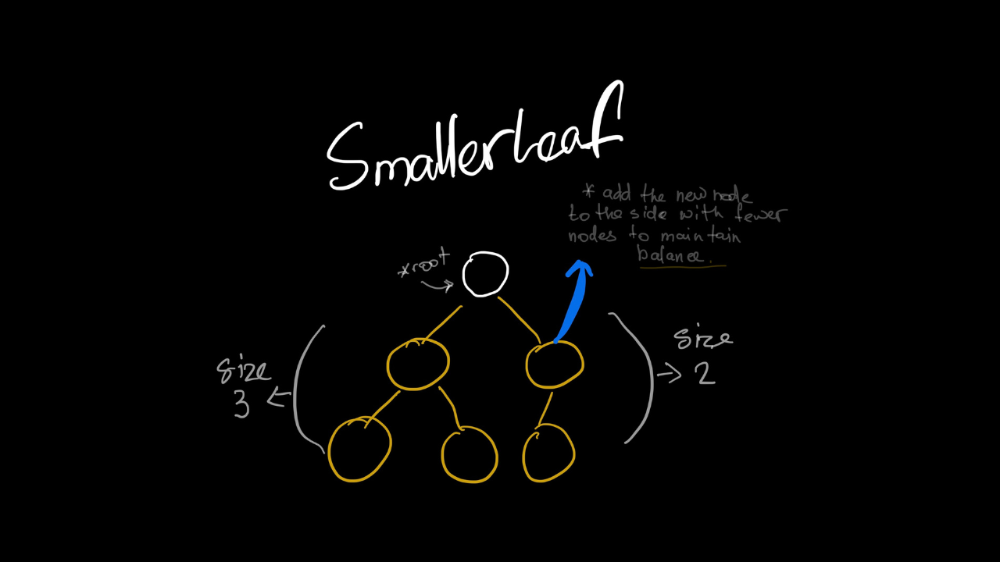
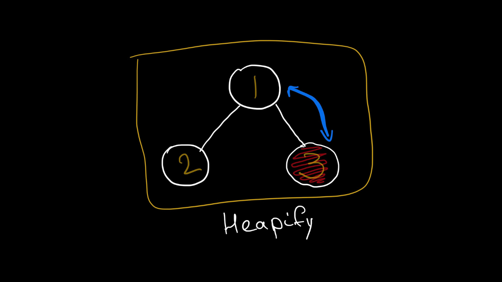

# Binary Heap

`Binary Heap` [data structure](../glossary.md#data-structure) ma'lumotlarni to'plamga juda tez qo'shish `O(log N)` va shu to'plamdagi eng katta/kichik elementni konstant `O(1)` vaqtda o'qish imkonini beradigan [**complete tree**](../glossary.md#complete-tree)]. U `heap sort`, `priority queue` va `Dijkstra's ` algoritmlarini o'zagi hisoblanadi. 

## Intro :wave:
Uni 2 ta asosiy hususiyatlari bor:

:heavy_check_mark: [**Complete Tree**](../glossary.md#complete-tree)
:heavy_check_mark: [ **Heap Property**](../glossary.md#heap-property)

Ushbu post orqali siz `Binary Heap`ni **C#** dasturlash tilida eng sodda usulda tushintirilishi visual elementlar orqali o'rganasiz :rocket:

 

> [!Note]
> Ish maydonini tayyorlab olish uchun `Heap.cs` nomli fayl yarating va uni ichida empty `Heap` deb nomlangan `class` yozing.
>
> [!code-csharp]
> 
> - `Heap` strukturaasi ichida istalgan turdagi ma'lumot saqlay olishni ta'minlash uchun uni [**generic**](https://learn.microsoft.com/en-us/dotnet/csharp/fundamentals/types/generics) `Heap<T>` qilib e'lon qilamiz.
> - **Heap**dagi  `where T : IComparable<T>` *constraint*i [*heap property*](../glossary.md#heap-property)ni saqlash uchun solishtirishda ishlatiladi.

---
 

## Node `class` 🥬

[Data Stucture](../glossary.md#data-structure) olamida [**node**](../glossary.md#node) iborasi juda ko'p ishlatiladi. Ular strukturani o'zagi bo'lib ma'lumotlarni o'rab turishda ishlatialdi.

 `Binary Heap` strukturasida har bir [**node**](../glossary.md#node) quyidagi elementlarni o'z o'chiga oladi.
 - `Value` - asosiy saqlanayotgan ma'lumot
 - `Left`- chap tarafdagi [**child**](../glossary.md#child)**-node**ga [reference](../glossary.md#reference)
 - `Right` - o'ng tarafdagi [**child**](../glossary.md#child)**-node**ga [reference](../glossary.md#reference)

:bulb: `Node` klasi faqat `Heap` kaslini ichki amallarida ishlatigani uchun uni `private` qilib **Heap** class ichida elon qilamiz.

[!code-csharp]

> [!Detail]
> 
> :bulb: `Node` **class**ida **C# 12**dagi [**primary constructor**](https://learn.microsoft.com/en-us/dotnet/csharp/language-reference/proposals/csharp-12.0/primary-constructors) hususiyati ishlatilgan.
> [!code-csharp]
> 
> - `Right` va `Left` [**child**](../glossary.md#child)**-node**larni keyinchalik to'liq manipulatsiya qila olishimiz va  **C#** da **property**larga `ref` kalit so'zini qo'yish mumkin emasligi uchun `ref` orqali *private backing field*lar e'lon qilib ma'lumotlarni shu *field*larda saqlaymiz. Keyin u *field*larga **property**lar orqali murojat qilamiz.
> [!code-csharp]

  

💡 Keling endi `Node` **class**iga keynchalik asqotadigan *helper method*lar qo'shib chiqamiz.

### `Node.Size` :straight_ruler:

> [!Detail]
>
> [!code-csharp]
> 
> `Node` **class**idagi `Size` **property**si [*recursive*](../glossary.md#recursion) tarzda joriy **Node** hajmini aniqlaydi. Har bir **node**ning **size**i `1 + Left.Size + Right.Size`ga teng.
> 

 

### `Node.SmallerChild` 

> [!Detail]
> 
> Ushbu property joriy **Node**ni kichikroq [**child**](../glossary.md#child)iga [*reference*](../glossary.md#reference) qaytaradi.
>
> [!code-csharp]

 

:star: Endi `Node` **class**ini asosiy *method*lariga o'tamiz.

### `Node.Heapify()`

> [!Detail]
> 
> `Heapify` funksiyasi [**heap property**](../glossary.md#heap-property)ni saqlab qolishni ta'minlaydi.
>
> [!code-csharp]
>
> - `Min-heap`: har bir **node** uchun [**parent**](../glossary.md#parent)**-node** qiymati [**child**](../glossary.md#child)**-node**lar qiymatidan KICHIK yoki teng bo'lishi shart. 
> - `Max-heap`: har bir **node** uchun [**parent**](../glossary.md#parent)**-node** qiymati [**child**](../glossary.md#child)**-node**lar qiymatidan KATTA yoki teng bo'lishi shart. 

> [!WARNING]
> Rasmda `Max-heap` ifodalangani uchun *3*  va *1* qiymatlari *swap* qilinishi kerak.

 

### `Node.SwapValueWith(Node other)`

> [!Detail]
> 
> Ushbu funksiya joriy *node* qiymatini berilgan *node* qiymati bilan alishtiradi.
>
> [!code-csharp]
>
> - E'tibor bering, faqat qiymatlar alishtirilgani uchun bu funksiyada hech qanday `ref` kalit so'zi ishlatilmagan.

 

:star: Ana endi navbat `Heap` **class**ini o'ziga keldi. Uni *member*lari haqida birma-bir to'xtalamiz.

## `Heap.root`
`Heap` **class**ida [**`root`**](../glossary.md#root) nomli *private field* yasab olamiz. U data strukturamiz boshlanish nuqtasi vazifasini bajaradi va birinchi *node*ga *reference* bo'ladi. Har safar `Heap`ni [**traverse**](../glossary.md#traverse) qilish  shu *object*dan boshlanadi.

[!code-csharp]

`Heap` **class**ida tashqariga ko'rinuvchi 3ta asosiy **public** methodlari mavjud. Ularni har biri haqida quyida batafsil to'xtalamiz.
- `Print()` - `Heap` **class**ini *traverse* qilib har bir node qiymatini chop etish uchun.
- `Enqueue(T value)` - yangi qiymatni kerakli joyga joylash uchun.
- `T Dequeue()` - eng tepadagi birichi elementni qaytarib uni o'chirib yuboradi va [**heap property**](../glossary.md#heap-property)ni qayta hisoblab qo'yadi.

## `Heap.Enqueue`

[!code-csharp]

> [!Detail]
> 
> Ko'rib turganingizdek `Enqueue()` **public** methodi shunchaki `EnqueueRecursive`ga kerakli parametrlarni uzatib yuboradi holos. Asosiy *logika* ushbu private recursive method ichida amalga oshadi.
> 
> Yangi elementi qo'shish **`O(log n)`** vaqt talab qiladi.
>
> - Logikaga e'tibor bering, shunchaki *recursive* tarzda `null reference` ya'ni `Heap` tubiga yetib tushmaguncha kichikroq shox tanlab, shu shox bo'ylab tushib boriladi.
> - `null reference`ga yetib kelganda, yangi node shu yerga joylanadi.
> - *`ref` imkoniyati bilan*, **current** obyekti qiymati `null` bolsa, ushbu obyekt referenci yangi yaratilgan nodega qaratib qo'yiladi. *Let that sink in!* :exploding_head:.
> 
> - Method oxirida `current.Heapify();` chaqiruvi *heap*ni eng tubiga tushib ortga rekursiv qaytish vaqtida har bir nodening [**heap property**](../glossary.md#heap-property)sini qayta hisoblab qo'yadi :boom:.

 

## `Heap.Dequeue`

[!code-csharp]

> [!Detail]
> 
> `Dequeue()` - bu [**root**](../glossary.md#root)**-node** o'chiriladi va uni o'rniga ikkita [child](../glossary.md#child)dan biri priority bo'yicha tanlab olinadi, va huddi shu tartibda uni childlari ham bittadan yuqoriga siljiydi
> 
> - **Dequeue** ham **Enqueue** kabi `O(log n)`** vaqt talab qiladi.
>
> - Avvalo **heap** empty bo'lsa `InvalidOperationException` otamiz.
> - Yo'qsa, rekursiv tarzda eng kichik qiymatli elementni `current` bilan *swap* qilib, pastga qarab ketaveramiz. 
> - [**leaf**](../glossary.md#leaf)**-node**ga yetib borganimizda, uni `null reference`ga tenglab qo'yamiz.
> - Bu orqali osha eng oxiridagi **node**ni o'chirgan bo'lamiz. Xotirani bo'shatishni `GC` o'zi qoyillatadi.

 

## `Heap.Print`

[!code-csharp]

> [!Detail]
> 
> `Print` funksiyasida qiymatlarni to'g'ri ketma ketlikda chop etish uchun `Queue` strukturasidan foydalanilgan.
> 
> - `Queue`da **node**lar qolmaguncha birinchi **node**ni olib chop etamiz va uni **child node**larini **queue**ga qo'shib ketaveramiz.
> - Shu orqali har bir qatordagi **node** chapdan o'ngga qarab bir xilda chop etib ketaveramiz.

 

## `Heap.Print`

Vanihoyat `Heap` klasimizdan obyekt olib uni sinab ko'rsak bo'ladi :sunglasses:
[!code-csharp]

---

| :star: To'liq kodni [mana bu yerda](https://gist.github.com/wahid-d/ab902d8e79140b217a8661cc1c710706) topasiz. :star:  |
| --- |

Kontent yoqqan bo'lsa unga izoh qoldirish va do'slaringizga ulashish orqali sifatli o'zbek tilidagi kontentni qo'llab quvvatlashingizni so'raymiz :heart:.

 

> [!Hint]
> Keyingi maqolada **Binary Heap** *Data Structure*ni eng ko'p uchraydigan **use case**larini misollar orqali o'rganamiz.
> 
> Shu kabi sifatli o'zbek tilidagi kontentni qo'llab quvvatlash uchun bizni [**Telegram Kanalimiz**](https://t.me/wahidustoz)ga obuna bo'ling.